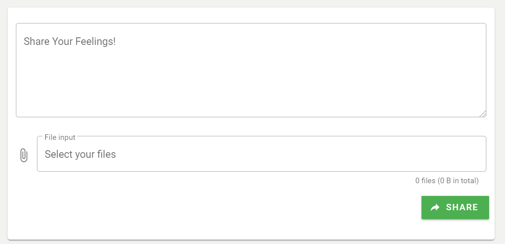
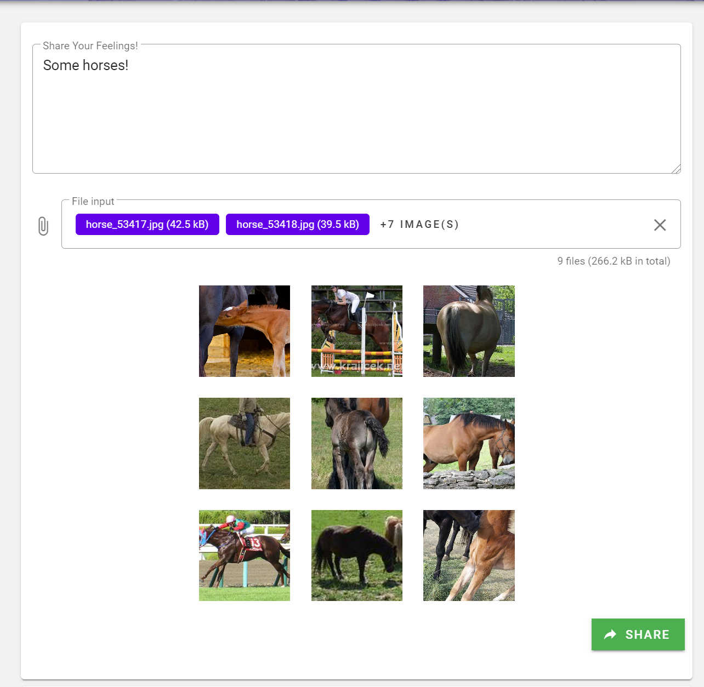

#### 前后端交互

本项目采用前后端分离的开发和部署方式。前端使用Axios向后端发送请求和接收响应。在使用npm安装Axios后，在main.js中加入以下代码段来将Axios插件引入。

```javascript
import axios from 'axios'
import VueAxios from 'vue-axios'

Vue.use(VueAxios, axios);
// 使用Cookie
axios.defaults.withCredentials=true;
Vue.prototype.$axios = axios;
...
new Vue({
  ...
  axios,
  render: h => h(App)
}).$mount('#app')
```

由于前端发送请求需要后端API的url，且要考虑跨域问题，所以我们需要统一配置Proxy。在vue.config.js中加入以下代码段：
```javascript
module.exports = {
  ...
  devServer: {
    proxy: {
      '/user': {
        target: "http://127.0.0.1:8000/", //后端url
        changeOrigin: true,	//跨域
      },
      '/blog': {
        target: "http://127.0.0.1:8000/",
        changeOrigin: true,
      },
      // 可添加其他后端接口
      ...
    },
  }
}
```
在按上述代码配置proxy以后，若后端发送请求的url中包含proxy配置中的key（如`/user`），会被自动加上target（这里是`http://127.0.0.1:8000/`）。例如，前端在发送请求时url为`/user/login`，那么真实请求报文中的url会被替换为`http://127.0.0.1:8000/user/login`。
在本地测试时这里的target使用local host(`http://127.0.0.1:8000/`)。在部署时我们要将target替换为后端服务的url。

在配置完成后我们介绍Axios的使用。因为在该项目中我们主要使用POST请求，所以以登录组件中向后端“用户登录”API发送的POST请求为例：

```javascript
methods: {
    req_login: function () {
      if (this.username == "" || this.password == "") {
        alert("请输入用户名和密码！");
      } else {
        var formdata = new FormData();	//定义formdata
        formdata.append("username", this.username);	//将请求数据加入formdata中
        formdata.append("password", this.password);
        this.axios
          .post("/user/login", formdata, {
            headers: { "Content-Type": "multipart/form-data" },	//由于后端API对类型有要求，所以请求时一定要设置content-type为multipart/form-data
          })
          .then((response) => this.ack_login(response)) //使用methods中的函数处理响应
          .catch(function (error) {
            console.log(error);
          });
      }
    },

    ack_login: function (response) {
      var data = response.data;	//后端响应中的数据
      if (data.error_code == 200) {	//后端定义的error_code, 据此判断请求的结果
        alert("登录成功！欢迎" + this.username);
        this.$router.push("/home");
      } else {
        alert("登录失败\n" + data.message);
      }
    },
  },
```

由于后端API目前全部要求请求使用*HTTP协议的`multipart/form-data`格式*，所以我们要先定义一个`FormData`对象，将请求报文数据中的键值对加入`FormData`对象中，然后发送请求。

#### 发布动态

在主页中间部分的顶端，用户可以发布动态。



蛋博中的动态内容包含文字和图片，其中图片上传的数量范围为0~9。同时，用户在上传了图片后，可以在下方预览自己上传的图片：



点击右下角的"share"发布动态后，下方动态推送列表会自动刷新，用户可以在列表中找到自己发送的动态：

